  

- 🏢 Co-Founder and lead architect at [Devpro](https://www.devprodigital.com/), a Software Development and Consulting Company
- 💼 Previously at CGI, Intact and Lattice Semiconductor
- 🎓 Software Engineering (BEng) Coop Student at McGill University
- 🌐 Learn more or contact me at [gianlucapiccirillo.com](https://gianlucapiccirillo.com)
- 🔗 Connect with me on [LinkedIn](https://www.linkedin.com/in/gianluca-piccirillo10/)
- 💻 Try my dev container with Docker [Here](https://github.com/GianlucaP106/dotfiles/blob/main/devcontainer/README.md)

 
 

  

